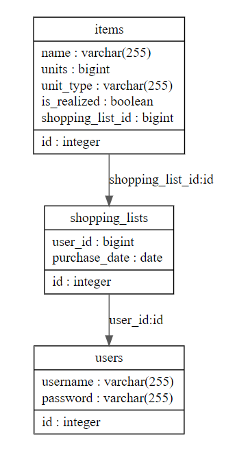
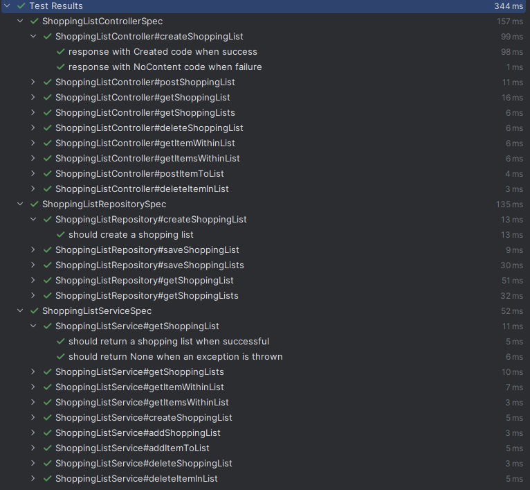
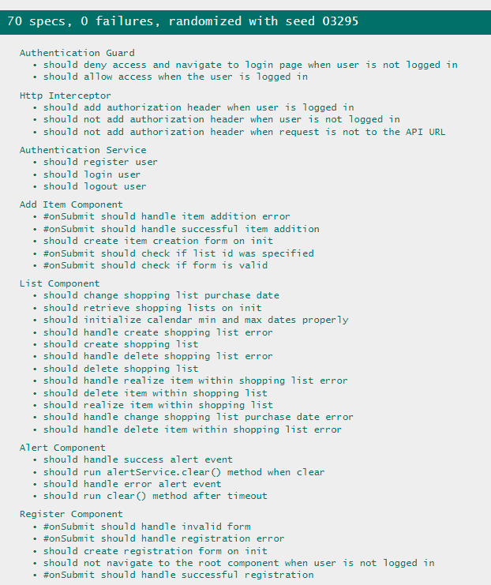
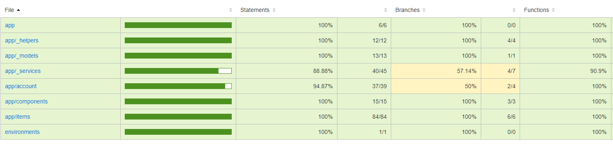
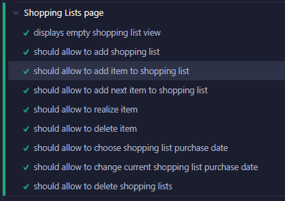
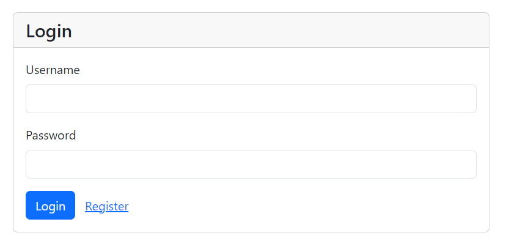
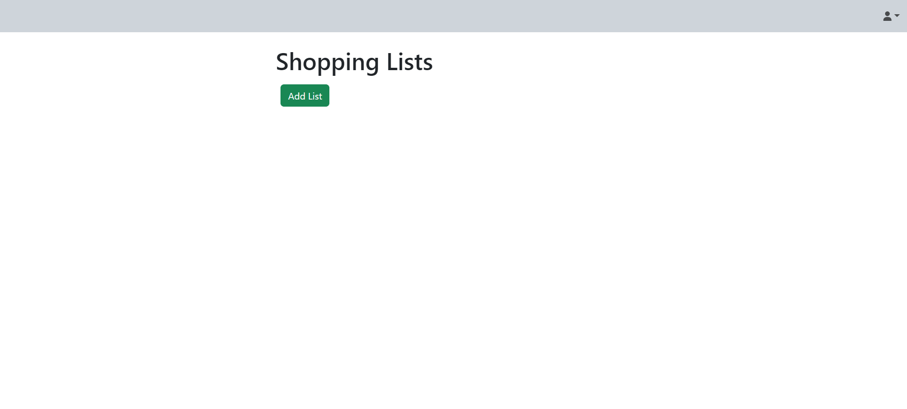
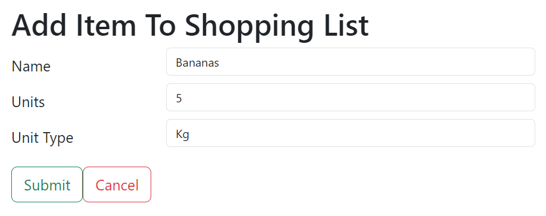
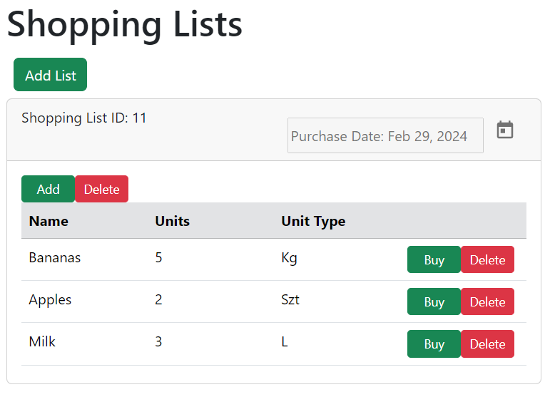
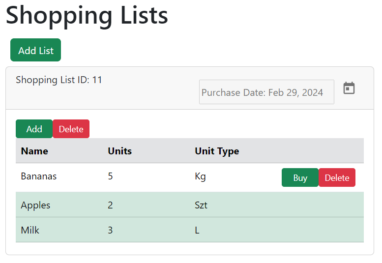

# Shopping List Project

This project is a simple shopping list web application. It consists of a backend developed in Scala with Play and Slick
frameworks, frontend developed in Angular and PostgreSQL database for persistence layer.
 
It provides basic functionalities to manage a shopping list including adding and removing items as well as choosing the
date of purchase.

## List of Contents

1. [Setup Instructions](#setup-instructions)
2. [Backend](#backend-scala-play)
3. [Frontend](#frontend-angular)
4. [Containers](#docker-compose-configuration)
4. [GUI](#gui)

## Setup Instructions:

1. Ensure you have Docker and Docker Compose installed on your system.
2. Clone the repository.
3. Navigate to the root directory of the project.
4. Run `docker-compose up` to start the services.
5. Application will be available at http://localhost:4200

## Backend Scala Play

The backend of the Shopping List project is built using Scala Play which is lightweight and scalable web framework. It
provides endpoints to handle user authentication and items management required for an online shopping list system. Scala
Slick was used as a data access library for application making it easy to work with relational databases.

### Technologies Used:

- Scala 3.3.1
- Play Framework
- Slick
- PostgreSQL
- ScalaTest for unit testing

### Relational Model:

This relational model represents the structure of tables in a database.

### Backend Tests:

Backend was thoroughly unit tested using a behavioral style along with mocking.

## Frontend Angular

The frontend of the Shopping List project is built using Angular framework, providing a modern and responsive user
interface for users to use application.

### Technologies Used:

- Angular
- TypeScript
- HTML
- Bootstrap styling
- Cypress for e2e testing

### Frontend Tests:

Frontend was extensively tested using unit, integrated and e2e tests with cypress.
Unit tests were written to test individual components such as Angular components or services.
Integrated tests were created to validate the interaction between different components.
Cypress was used to simulate user interactions across the entire application.

- **Unit and Integration Tests**
  

  
  

- **Tests Coverage**
  

  
  

- **Cypress Tests**

  

  
  

## Docker Compose Configuration

Docker Compose configuration is provided to easily deploy the Shopping List project along with its dependencies in
isolated containers.

### Services Included:

- Backend (Scala Play)
- Frontend (Angular)
- PostgreSQL Database

## GUI

### List of GUI components:

- **Login Form**
  

  
  

  - The login form allows user to enter their credentials.

- **Registration Form**

  

  
  

  - The registration form allows new users to create an account.

- **Main Page**

  

  
  

  - The home page serves as the main landing page of the application.

- **New Item Form**

  

  
  

  
  - The item creation form allows users to add new items to the list.

- **List View**

  

  
  

  - The current list is displayed at main page.

- **Ticking Out Items**

  

  
  

  - Items can be marked as purchased.